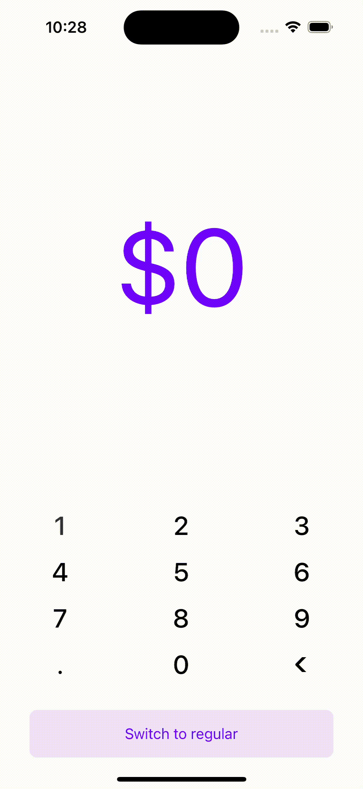

# react-native-animated-digits

Beautifully animated digits for React Native.

<p>



</p>

## Installation

```sh
npm install react-native-animated-digits
```

## Usage

```js
import { AnimatedDigits } from 'react-native-animated-digits';

// ...

const [usd, setUsd] = useState('0');

return (
    <View style={styles.container}>
        <AnimatedDigits value={usd} />
        // ...
    </View>
);
```

## Props

| name                        | required | default                                                  | types                              | description                                                                                                                  |
| --------------------------- | -------- | -------------------------------------------------------- | ---------------------------------- | ---------------------------------------------------------------------------------------------------------------------------- |
| value                       | ✅       |                                                          | string                             | A number parseable string, if using the default `makeAnimatedItems` or a custom string if using a custom `makeAnimatedItems` |
| prefix                      | ❌       |                                                          | string                             | The value to display in front of the digits                                                                                  |
| prefixProps                 | ❌       | {}                                                       | TextStyle                          | Prefix text style                                                                                                            |
| suffix                      | ❌       |                                                          | string                             | The value to display after the digits                                                                                        |
| suffixProps                 | ❌       | {}                                                       | TextStyle                          | Suffix text style                                                                                                            |
| width                       | ❌       | SCREEN_WIDTH\*0.9                                        | number                             | Specified animated digits width                                                                                              |
| textProps                   | ❌       | {fontSize: SCREEN_WIDTH\*0.3, letterSpacing: -2}         | TextStyle                          | Digits text style                                                                                                            |
| makeAnimatedItems           | ❌       | Formats value with commas and creates the animated items | (value: string) => AnimatedItem[]  | Makes the array for the animated items to display                                                                            |
| keyExtractor                | ❌       | Each item type is given a unique key                     | (value: AnimatedItem) => React.Key | Gets a unique key for the given item                                                                                         |
| initialEnterAnimationConfig | ❌       | Fade in enter animation                                  | EnterAnimationConfig               | The type of animation for the first render of the animated digits                                                            |
| enterAnimationConfigCreator | ❌       | Scale-fade enter animation                               | EnterAnimationConfig               | The type of animation for new digits added to the view                                                                       |
| exitAnimationConfigCreator  | ❌       | Scale-fade exit animation                                | ExitAnimationConfig                | The type of animation for digits removed from the view                                                                       |
| layoutAnimation             | ❌       | Linear layout transition                                 | LayoutAnimationConfig              | The type of animation during transitions, ie digits being added/removed                                                      |
| style                       | ❌       | {}                                                       | ViewStyle                          | Container style                                                                                                              |

## Extending

Extending animations is as simple as below. See the [example repo](https://github.com/ThasianX/react-native-animated-digits/tree/main/bareExample) for how to override the animation to achieve a lottery-like animation.

```js
const lotteryEnterAnimationConfigCreator: EnterAnimationConfigCreator = (() => {
    return {
        ...defaultEnterAnimationConfigCreator,
        [AnimatedItemType.DIGIT]: () =>
            makeAnimation({
                translateY: {
                    from: 10,
                    to: 0,
                },
                duration: 150,
            }),
    };
})();

...

return (
    <AnimatedDigits
        value={usd}
        enterAnimationConfigCreator={customConfigCreator}
    />
)
```

## Contributing

I do not plan to maintain this repo. However, please feel free to make pull requests for any features/bugs.

## License

MIT
